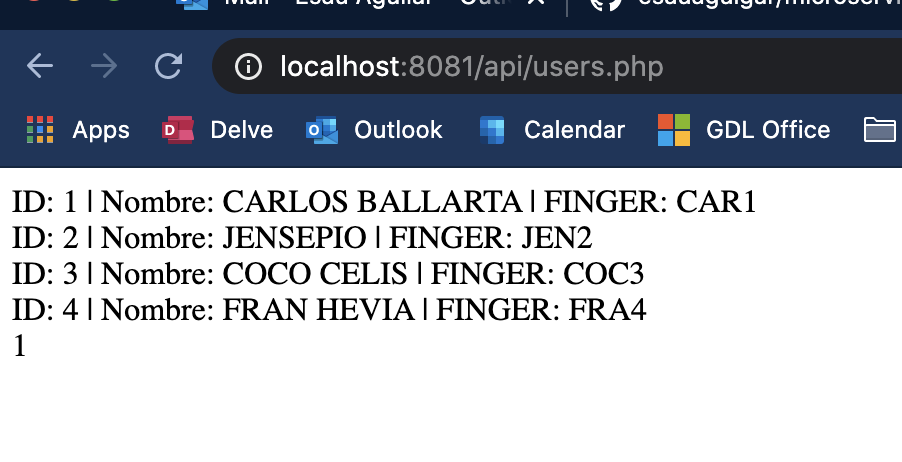
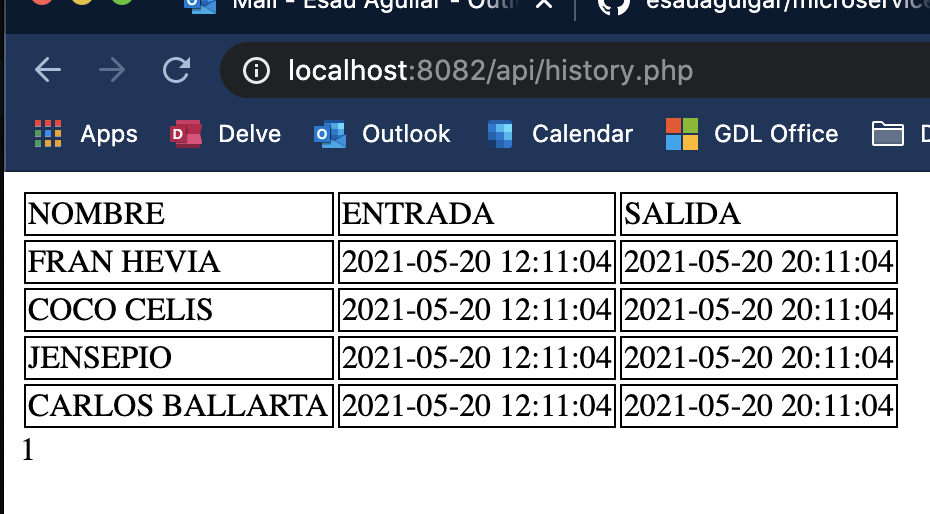
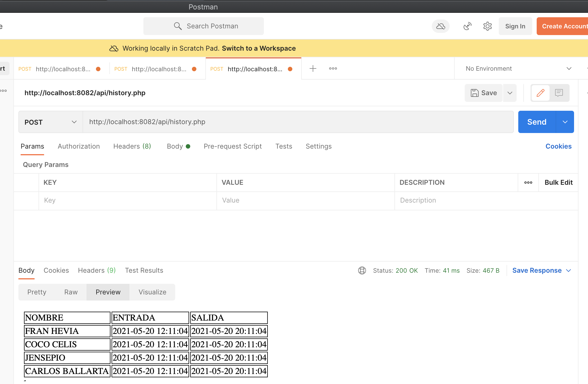
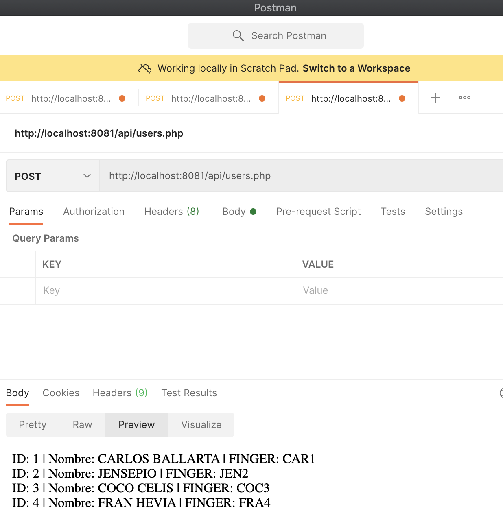

# microservices - attendance clock

## run the next command where is file docker-compose.yaml
```
	docker-compose up --build -d
```

POST

Registry service
- for check all hiistory
http://localhost:8082/api/history.php

- url to record arrival hour
http://localhost:8082/api/entrance.php?finger=

- to record the departure time
http://localhost:8082/api/exit.php?finger=


Users service

- url to show all users registered
http://localhost:8081/api/users.php

- url to search an specific user
http://localhost:8081/api/user.php?id=

- url to registe a new user
http://localhost:8081/api/new_user.php?name=&finger=

- url to edit info of an specific user
http://localhost:8081/api/edit_user.php?name=&finger=

browser:



postman

